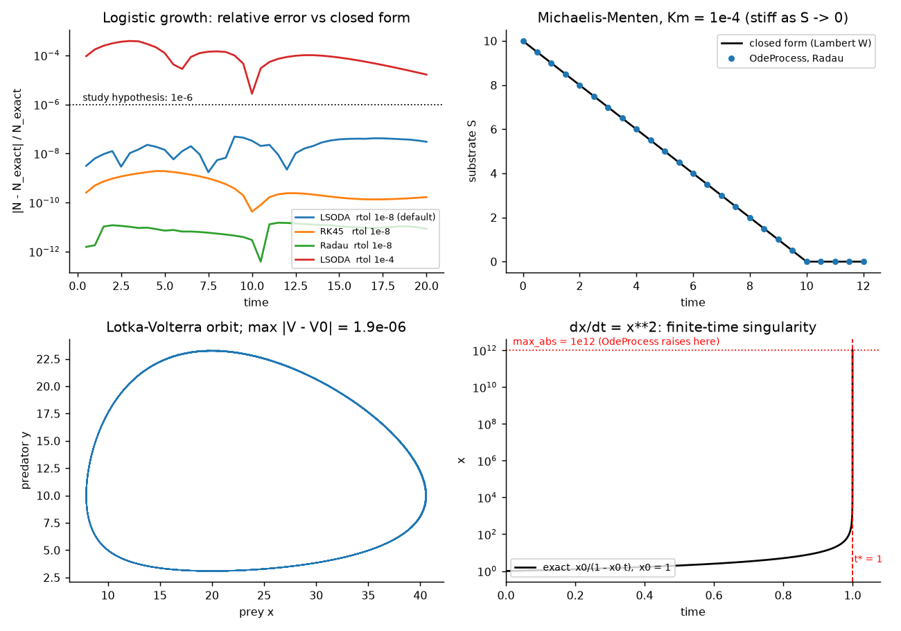
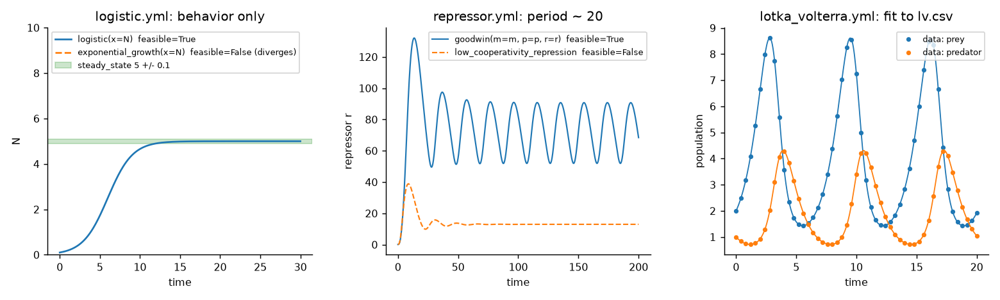

# viva-expressions

**Write a dynamical model as strings, run it as a [process-bigraph](https://github.com/vivarium-collective/process-bigraph) composite, and, if you only know how the system should *behave*, let the repo search for the equations.**

<!-- BEGIN dashboard -->
> ## 📊 [**Live dashboard →**](https://vivarium-collective.github.io/viva-expressions/dashboard/)
> Browse every investigation & study interactively, or read the [published investigation reports](https://vivarium-collective.github.io/viva-expressions/). Auto-published from `main` on every merge.
<!-- END dashboard -->

```python
from viva_expressions.composites import ode_document, run_document

doc = ode_document(
    rhs={"N": "r*N*(1 - N/K)"},            # the model, as a string
    params={"r": 0.5, "K": 100.0},
    initial={"N": 5.0},
    interval=0.5,
)
t, series = run_document(doc, t_end=20.0)  # a real process-bigraph Composite run
print(series["N"][-1])                     # 99.91...  (approaching the carrying capacity K = 100)
```

Two ideas, one repo:

| | What you give it | What you get |
|---|---|---|
| **Expressions** | equations as strings | a typed, composable process-bigraph `Process` (`OdeProcess`) and `Step` (`MathExpressionStep`) that wire to any other module through plain `float` ports |
| **Synthesis** | expected behavior and/or data, plus candidate structures | the best-fitting model as a process-bigraph document, **verified by re-running it in a real Composite**, with a ranked report of every rival |

On top of that sits a validation workspace: a study that checks the expression layer against closed-form solutions, and a planned investigation that benchmarks it against established simulators ([status](#status-what-is-built-and-what-is-planned)).

<p align="center"></p>

*Every curve above is computed by [`scripts/make_readme_figures.py`](scripts/make_readme_figures.py) from this repo's own code (see [Validation](#validation-against-closed-forms)).*

## Contents

[Install](#install) · [Expressions](#expressions) · [Composing](#composing-with-other-processes) · [Validation](#validation-against-closed-forms) · [Synthesis](#synthesis-from-behavior-to-a-verified-model) · [Workspace and dashboard](#workspace-and-dashboard) · [Status](#status-what-is-built-and-what-is-planned) · [Layout](#repository-layout) · [Develop](#develop) · [Known limitations](#known-limitations)

## Install

Needs Python ≥ 3.12 and [uv](https://docs.astral.sh/uv/).

```bash
git clone https://github.com/vivarium-collective/viva-expressions.git
cd viva-expressions
uv sync                    # installs the dev group, which includes PySINDy
uv run pytest              # about 90 seconds
```

Synthesize a model from a behavior spec (a few seconds):

```bash
uv run python -m viva_expressions.synthesize systems/examples/logistic.yml --out /tmp/logistic_out
# logistic: verified — winner logistic(x=N), theta {'r': 0.65..., 'K': 5.0000009}
# report: /tmp/logistic_out/report.md
```

## Expressions

### `OdeProcess`: `dy/dt = f(y, u; p)`, written as strings

```python
config = {
    "rhs": {"N": "r*N*(1 - N/K)"},   # one equation per integrated variable
    "params": {"r": 0.5, "K": 100.0},# named constants
    "state_vars": ["N"],             # integrated, in order
    "input_vars": [],                # exogenous values, held constant over each interval
    "method": "LSODA",               # any scipy solve_ivp method (default LSODA)
    "rtol": 1e-8, "atol": 1e-10,     # defaults
    "max_abs": 1e12,                 # divergence bound, see below
}
```

Over each interval the process integrates with `scipy.integrate.solve_ivp`, using a Jacobian derived symbolically from your expressions, and emits **deltas** on plain `float` ports (the process-bigraph convention). Inputs `u` are frozen for the whole interval, so the coupling between processes is explicit and its cost is measurable.

**It fails loudly instead of stalling.** LSODA never returns on `dx/dt = x²` (a finite-time singularity), so a terminal event stops integration the moment any `|state|` exceeds `max_abs`, and the update raises:

```python
from viva_expressions.composites import ode_document, run_document

doc = ode_document({"x": "x**2"}, params={}, initial={"x": 1.0}, interval=0.1)
run_document(doc, t_end=3.0)   # the exact solution is 1/(1 - t), so it blows up at t = 1
# RuntimeError: OdeProcess integration failed over interval 0.1: |state| exceeded max_abs=1e+12 at t=0.0999999; rhs={'x': 'x**2'}, state={'x': np.float64(10.000003812865044)}
```

### Why a custom parser

Model names like `N`, `E`, `I`, `S`, `Q`, `gamma` and `beta` collide with sympy built-ins (`sympy.sympify("N*x")` raises `TypeError`). [`viva_expressions/expressions.py`](viva_expressions/expressions.py) binds every identifier to a plain symbol first, keeps `sin(x)` and `exp(x)` as functions, treats `pi` as the constant, and rejects anything undeclared:

```python
from viva_expressions.expressions import parse, compile_rhs

parse("N*x + gamma*sin(beta)")           # N*x + gamma*sin(beta)
parse("a*x", allowed=["x"])              # ValueError: undeclared symbol(s) ['a'] in 'a*x'

rhs = compile_rhs({"x": "-k*x"}, state=["x"], params=["k"])   # f and its Jacobian
import numpy as np
rhs.f(np.array([2.0]), np.array([]), np.array([0.5]))          # array([-1.])
rhs.jac(np.array([2.0]), np.array([]), np.array([0.5]))        # array([[-0.5]])
```

### `MathExpressionStep`: derived values as a dependency graph

A `Step` that compiles a list of expressions into a topologically ordered DAG. Input ports are inferred as the free symbols that are neither another expression's output nor a parameter; outputs are `overwrite[float]`.

```python
{
    "expressions": [
        {"out": "rate",       "expr": "r*N*(1 - N/K)"},
        {"out": "per_capita", "expr": "rate/N"},        # depends on `rate`: ordered automatically
    ],
    "params": {"r": 0.5, "K": 100.0},
}
# inputs() -> {"N": "float"}      outputs() -> {"rate": "overwrite[float]", "per_capita": "overwrite[float]"}
```

## Composing with other processes

Both classes are ordinary process-bigraph processes registered by [`viva_expressions.core.build_core`](viva_expressions/core.py), so an `OdeProcess` can drive, or be driven by, anything that speaks `float` ports. Here the growth rate and per-capita rate are derived from the integrated state by a `MathExpressionStep`:

```python
from process_bigraph import Composite
from process_bigraph.emitter import emitter_from_wires, gather_emitter_results
from viva_expressions.core import build_core
from viva_expressions.composites import ode_document

doc = ode_document({"N": "r*N*(1 - N/K)"}, {"r": 0.5, "K": 100.0}, {"N": 5.0}, interval=1.0)
state = doc["state"]
state["rate"], state["per_capita"] = 0.0, 0.0
state["derived"] = {
    "_type": "step",
    "address": "local:!viva_expressions.processes.math_expression.MathExpressionStep",
    "config": {"expressions": [{"out": "rate", "expr": "r*N*(1 - N/K)"},
                               {"out": "per_capita", "expr": "rate/N"}],
               "params": {"r": 0.5, "K": 100.0}},
    "inputs": {"N": ["N"]},
    "outputs": {"rate": ["rate"], "per_capita": ["per_capita"]},
}
state["emitter"] = emitter_from_wires({k: [k] for k in ["N", "rate", "per_capita", "global_time"]})

composite = Composite(doc, core=build_core())
composite.run(10.0)
for row in gather_emitter_results(composite)[("emitter",)][::2]:
    print(f"t={row['global_time']:4.0f}  N={row['N']:7.3f}  rate={row['rate']:6.3f}  per_capita={row['per_capita']:5.3f}")
```

```
t=   0  N=  5.000  rate= 2.375  per_capita=0.475
t=   2  N= 12.516  rate= 5.475  per_capita=0.437
t=   4  N= 28.000  rate=10.080  per_capita=0.360
t=   6  N= 51.389  rate=12.490  per_capita=0.243
t=   8  N= 74.184  rate= 9.576  per_capita=0.129
t=  10  N= 88.651  rate= 5.031  per_capita=0.057
```

The same document is plain JSON, so it round-trips through `json.dumps`/`json.loads` and runs anywhere a process-bigraph core with this package is available.

## Validation against closed forms

The four analytic baselines under [`viva_expressions/composites/`](viva_expressions/composites/) each carry an oracle: a closed-form solution or a conserved quantity.

| Baseline | Equations | Oracle | Measured here (`rtol=1e-8`, `atol=1e-10`) |
|---|---|---|---|
| `logistic_growth` | `dN/dt = r N (1 - N/K)` | `N(t) = K / (1 + ((K-N0)/N0) e^{-rt})` | max relative error **4.9e-8** (LSODA), 1.9e-9 (RK45), 1.5e-11 (Radau) |
| `michaelis_menten` | `dS/dt = -Vmax S/(Km+S)`, `dP/dt = +…` | `S(t) = Km·W((S0/Km) e^{(S0-Vmax t)/Km})` and `S+P = S0` | max abs error **9.4e-8**; mass drift 1e-14 |
| `lotka_volterra` | `dx/dt = a x - b x y`, `dy/dt = d x y - g y` | first integral `V = d x - g ln x + b y - a ln y` is constant | max `|V - V0|` **1.9e-6** over 50 time units |
| `quadratic_blowup` | `dx/dt = x²` | `x(t) = x0/(1 - x0 t)`, blow-up at `t* = 1/x0` | must raise at `max_abs`, never stall (see above) |

Reproduce any row in a few lines (the stiff Michaelis-Menten case, `Km/S0 = 1e-5`, as the example):

```python
import numpy as np
from scipy.special import wrightomega
from viva_expressions.composites import ode_document, run_document

Vmax, Km, S0 = 1.0, 1e-4, 10.0
doc = ode_document({"S": "-Vmax*S/(Km + S)", "P": "Vmax*S/(Km + S)"},
                   {"Vmax": Vmax, "Km": Km}, {"S": S0, "P": 0.0}, interval=0.5, method="Radau")
t, s = run_document(doc, 12.0)

# W(exp(z)) = wrightomega(z), which stays finite where exp(z) overflows (tiny Km)
exact = Km * wrightomega(np.log(S0 / Km) + (S0 - Vmax * t) / Km)
print(np.max(np.abs(s["S"] - exact)))    # 1.9e-10
```

> The oracle uses `wrightomega` because the textbook `lambertw((S0/Km)*exp(...))` overflows to `inf` for small `Km`, which would make the stiff variants look like failures of the *solver* rather than of the oracle.

## Synthesis: from behavior to a verified model

You describe the system you want; the pipeline proposes structures, fits their parameters, and keeps only what survives an independent re-run.


### A spec, end to end

[`systems/examples/logistic.yml`](systems/examples/logistic.yml) is qualitative only: no data, just what the system should do.

```yaml
name: logistic
time: {t_end: 30, n_points: 301}
variables:
  y:
    - {name: N, value: 0.1, bounds: [0, null]}
behavior:
  description: Grows from a small seed, levels off at 5, never overshoots.
  features:
    - {kind: steady_state, var: N, value: 5.0, tol: 0.1}
    - {kind: settling_time, var: N, value: 12.0, band: 0.02, tol: 3.0}
    - {kind: monotonic, var: N, direction: increasing}
candidates:
  - {motif: logistic, bind: {x: N}}
  - {motif: exponential_growth, bind: {x: N}}
```

```bash
uv run python -m viva_expressions.synthesize systems/examples/logistic.yml --out /tmp/logistic_out
```

which writes `report.md`, `report.json` and `composite.json` (without `--out` they go to `systems/examples/<name>_out/`). A condensed excerpt of the report:

```
**Status:** verified      Winner: logistic(x=N), k = 2         dN/dt = r*N*(1 - N/K)      r = 0.650354,  K = 5

Re-run through a real Composite: verified = True, max deviation from fit = 1.38e-06 (limit 0.001).

| # | name                       | k | feasible | loss      | worst feature         |
| 1 | logistic(x=N)              | 2 | True     | 2.319e-09 | SteadyState(N) 4.8e-05|
| 2 | exponential_growth(x=N)    | 1 | False    | 500       | SteadyState(N) 10     |
```

The rival is not hidden: it is ranked second, infeasible, with the feature it misses worst. Exit codes: `0` verified, `2` no feasible (or no verified) model, `1` invalid spec. A bad spec reports every problem at once, each prefixed with its field path:

```
$ uv run python -m viva_expressions.synthesize bad.yml --check
invalid spec:
  - behavior.features[0].tol: must be > 0, got -1
```

### How a feature is scored

Each behavior feature becomes a residual vector scaled so that **`|r| = 1` means exactly at tolerance**; a trajectory satisfies a feature when every residual has `|r| ≤ 1`.

| `kind` | Satisfied when | Tolerance |
|---|---|---|
| `steady_state` | final value ≈ `value` and the last 10 % of the run is flat | absolute, in units of `var` |
| `settling_time` | first time after which `var` stays within `band` × \|end − start\| of its final value ≈ `value` | absolute time |
| `monotonic` | no reversal against `direction` beyond 0.1 % of the trajectory's scale | built in |
| `bounds` | stays within `min` / `max` (either or both) | built in |
| `oscillation` | ≥ 2 prominent peaks, `period` (and optional `amplitude`) match, and it is `sustained` (not decaying at the end of the run) | relative; `t_end` must cover ≥ 2 periods |

Variable `bounds` join the behavior as implicit `bounds` features. With **data**, the data defines the optimum and features become constraints (only the part of a residual beyond tolerance is penalized); without data the features are the targets. The full spec grammar is annotated in [`systems/template.yml`](systems/template.yml).

### Motif library

`uv run python -m viva_expressions.synthesize --list-motifs` prints these with their equations and default parameter bounds.

| Motif | Roles | Equation(s) |
|---|---|---|
| `exponential_decay` | x | `x' = -k x` |
| `exponential_growth` | x | `x' = r x` |
| `logistic` | x | `x' = r x (1 - x/K)` |
| `hill_activation` | x ← s | `x' = beta s^n/(Kd^n + s^n) - gamma x` |
| `hill_repression` | x ← s | `x' = beta/(1 + (s/Kd)^n) - gamma x` |
| `michaelis_menten` | s | `s' = -Vmax s/(Km + s)` |
| `harmonic_oscillator` | x, v | `x' = v`, `v' = -omega² x` |
| `damped_oscillator` | x, v | `x' = v`, `v' = -omega² x - 2 zeta omega v` |
| `lotka_volterra` | prey, predator | `prey' = a prey - b prey predator`, `predator' = -c predator + d prey predator` |
| `goodwin` | m, p, r | three-stage negative-feedback oscillator; with equal stage rates it oscillates only for Hill `n > 8` |

A candidate is either `{motif, bind}` (roles renamed to your variables) or a **custom** `{name, rhs, params}`, where each parameter has `[lo, hi]` bounds. If `data` is supplied, [PySINDy](https://pysindy.readthedocs.io/) also proposes polynomial structures and every one competes on the same footing.

### Results on the bundled examples

<p align="center"></p>

| Spec | Question put to the pipeline | Outcome (single core, this repo's code) |
|---|---|---|
| [`logistic.yml`](systems/examples/logistic.yml) | behavior only: saturate at 5 | verified, ~4 s |
| [`oscillator.yml`](systems/examples/oscillator.yml) | behavior only: undamped, period 2π, amplitude 1 | `harmonic_oscillator`, `omega = 1.0000048`, ~13 s |
| [`repressor.yml`](systems/examples/repressor.yml) | "a repressor that oscillates with a period of ~20" | `goodwin` wins with `n = 17.8`; the low-cooperativity rival cannot oscillate; ~110 s |
| [`lotka_volterra.yml`](systems/examples/lotka_volterra.yml) | recover predator-prey structure from `lv.csv` | verified, ~36 s |

The last row is a recovery test with a known answer: [`make_lv_csv.py`](systems/examples/make_lv_csv.py) generated the data from `a=1, b=0.5, c=1, d=0.25`, and the fit returns `a=1.000003, b=0.500001, c=0.999998, d=0.250000`. PySINDy independently proposed the same four-term quadratic structure (`sindy#2`, identical AICc), and ranks it first; the 16- and 20-term SINDy alternatives score worse (AICc −1.93e4 and −1.65e4 against −2.04e4).

The report also tells you what the spec *does not* determine. For the repressor it states **"Not identifiable from this spec: alpha, Ki, n"**: the behavior pins the period, not those parameters individually, so any value along the flat direction fits equally well. Treat such a winner as a family, not a measurement.

### What "verified" means

The winner is exported as a process-bigraph document, **re-run in a real `Composite` through `OdeProcess` at its own tolerances**, and re-scored. It is verified only if every feature is still satisfied *and* the Composite trajectory agrees with the fitter's to within 1e-3 of each variable's scale. A fit that passes in the optimizer but not in the exported composite is reported `unverified`, so the artifact you ship is the one that was checked.

## Workspace and dashboard

This repo is also a [viva-superpowers](https://github.com/vivarium-collective/viva-superpowers) workspace (see [`workspace.yaml`](workspace.yaml)): its research objects live in `workspace/` and are served by [vivarium-workbench](https://github.com/vivarium-collective/vivarium-workbench).

```bash
uv run vivarium-workbench serve --workspace .      # picks a free port and prints it
```

Open it to browse the four composites (each is listed with its description and parameters), the study, and the process registry. The published, read-only version is the [live dashboard](https://vivarium-collective.github.io/viva-expressions/dashboard/) at the top of this page. `make workbench-serve` runs the same server against the shared UConn remote backend instead of local compute.

### Composites and investigations in this workspace

<!-- BEGIN:composites -->
<!-- generated by `vivarium-workbench gen-readme` — edit the source, not this table -->

| Composite | What it is |
|---|---|
| `logistic_growth` | Logistic growth dN/dt = r*N*(1-N/K) integrated by OdeProcess; closed-form solution N(t)=K/(1+((K-N0)/N0)*exp(-r t)) is the validation oracle. |
| `lotka_volterra` | Lotka-Volterra predator-prey dx/dt = a*x - b*x*y, dy/dt = d*x*y - g*y integrated by OdeProcess; oracle is the first integral V(x,y) = d*x - g*ln(x) + b*y - a*ln(y), conserved exactly along trajectori… |
| `michaelis_menten` | Michaelis-Menten substrate depletion dS/dt = -Vmax*S/(Km+S), dP/dt = +Vmax*S/(Km+S) integrated by OdeProcess; oracles are the closed form S(t) = Km*W((S0/Km)*exp((S0 - Vmax*t)/Km)) (Lambert W) and th… |
| `quadratic_blowup` | Finite-time singularity dx/dt = x**2 integrated by OdeProcess; exact solution x(t) = x0/(1 - x0*t) diverges at t* = 1/x0. |
<!-- END:composites -->

<!-- BEGIN:investigations -->
<!-- generated by `vivarium-workbench gen-readme` — edit the source, not this table -->

| Investigation | Research question |
|---|---|
| simulator-benchmarking _(planning)_ |  |
<!-- END:investigations -->

### The study: `expression-kinetics-analytic`

[`workspace/studies/expression-kinetics-analytic/study.yaml`](workspace/studies/expression-kinetics-analytic/study.yaml) is the machine-readable form of the [Validation](#validation-against-closed-forms) table: **4 baselines** (the composites above) and **13 variants** that sweep what the closed forms are sensitive to.

| Axis | Variants |
|---|---|
| solver method | `logistic_rk45`, `logistic_radau`, `mm_bdf`, `lv_dop853` |
| tolerance | `logistic_rtol_loose`, `logistic_rtol_tight`, `lv_rk45_loose`, `lv_rtol_tight` |
| stiffness (`Km` = 1e-4) | `mm_stiff_lsoda`, `mm_stiff_radau`, `mm_stiff_rk45` |
| guard | `blowup_low_guard` (`max_abs` = 1000), `blowup_x0_2` (`t*` = 0.5) |

> **Question.** Does the expression-defined `OdeProcess` reproduce closed-form solutions and conserved quantities within numeric error bands across solver methods, tolerances and stiff regimes, and does its `max_abs` guard fail loudly at a finite-time singularity?
> **Hypothesis.** At default tolerances every analytic baseline lands within a relative error of 1e-6 of its oracle for every method; error grows with `rtol` but stays inside a band set by it; `dx/dt = x²` raises the `max_abs` error at `t = 1/x0` instead of stalling.

The figure at the top and the [Validation](#validation-against-closed-forms) table are this hypothesis checked directly in Python.

## Status: what is built and what is planned

Candidate work, strongest first (from [`docs/new-work-candidates.md`](docs/new-work-candidates.md)):

| # | Work | State |
|---|---|---|
| 1 | **Single study: expression-defined kinetics against analytic solutions.** The foundation for new models; needs no installs. | **Built** as a study (4 baselines, 13 variants, oracles checked above). Not yet run through the workbench, and the oracle bands are not yet encoded as study readouts (see [limitations](#known-limitations)). |
| 2 | **Single study: gene-circuit dynamics** (repressilator or toggle switch) as pure expressions; sweep Hill coefficient and degradation rate to find the oscillation-to-steady-state boundary; `MathExpressionStep` supplies period/amplitude observables. | **In progress.** The synthesis side exists (`goodwin` motif, `repressor.yml`); the study itself is not yet in `workspace/studies/`. |
| 3 | **Investigation: does the expression layer reproduce established simulators?** `OdeProcess` against viva-tellurium, viva-copasi and viva-pysces on the same models from 1 and 2 (ideally via viva-biomodels): kinetics, oscillator and stiff case; trajectory agreement and cost. | **Planned.** [`simulator-benchmarking`](workspace/investigations/simulator-benchmarking/investigation.yaml) exists with its research question in `description` (its `question:` field is still blank) and no member studies yet. |
| 4 | **Investigation: composition with existing modules.** Expressions as glue: an `OdeProcess` controller driving viva-comets or spatio-flux (dFBA); (a) the port and type contract with a one-way coupling, (b) closed-loop feedback, (c) sensitivity to the coupling interval. | **Planned**, and the riskiest: the ports of the uninstalled modules are unverified. |
| 5 | **Single study: deterministic vs stochastic validity.** `OdeProcess` against viva-smoldyn or viva-nfsim as copy number falls, to find where the ODE approximation breaks. | **Planned**; needs the stochastic wrapper installed first. |

Suggested order: **1 → 2 → 3**, then **4** once 3 shows the ports line up. Candidates 1 and 2 can start now, and 3 reuses their baselines.

Before building any of these, confirm: (a) the remaining registry steps and processes; (b) the port and type contracts of whichever modules you install; (c) the viva-emitters outputs, so the studies have observables to check. Installed modules today are `viva-basic-processes` and `viva-emitters`; the rest of the catalog (tellurium, copasi, pysces, comets, nfsim, smoldyn, torch, …) installs through the workbench's `/api/catalog-install`.

## Repository layout

```
viva_expressions/
  expressions.py            parse / compile_rhs: symbols, Jacobian (the shared parser)
  processes/ode.py          OdeProcess
  processes/math_expression.py   MathExpressionStep
  composites.py             ode_document(), run_document()  (build and run a one-process document)
  composites/*.composite.yaml    the four analytic baselines
  core.py                   build_core(): registers this package's processes
  synthesize/               spec · motifs · fit · select · sindy · behavior · export · pipeline · CLI
systems/                    template.yml (annotated spec) and examples/ (4 specs + lv.csv)
workspace/                  studies/ · investigations/ · references/ · reports/  (viva-superpowers layout)
tests/                      OdeProcess, MathExpressionStep, parser, spec, motifs, fit/select, SINDy, CLI, behavior
scripts/make_readme_figures.py   regenerates docs/img/*.png
docs/                       new-work-candidates.md · first-run-agent-guide.md
```

## Develop

```bash
uv run pytest                                      # tests/ (~90 s)
uv run python scripts/make_readme_figures.py       # regenerate docs/img/*.png (~3 min)
```

- **Tests** cover the process and step in real Composites (e.g. logistic against its analytic solution, a Lotka-Volterra run against an independent `solve_ivp`, JSON round-tripping, the guard), the parser, spec validation (exhaustive error reporting), the motif library, fitting and ranking, SINDy, and the synthesis CLI end to end, including re-running an exported `composite.json` in a fresh Composite.
- **CI** (`.github/workflows/`): `workspace-ci` runs the tests on every push to `main` and on pull requests; `publish-dashboard` and `publish-reports` republish the site to `gh-pages` when `workspace/**` changes; `build-and-push` builds the container image on `v*` tags. The `Dockerfile` serves the workbench on port 9863.
- **Agents.** [`AGENTS.md`](AGENTS.md) holds the PR conventions (feature PRs vs. investigation PRs) and [`docs/first-run-agent-guide.md`](docs/first-run-agent-guide.md) is a runbook for a coding agent taking a new user from zero to a running workbench.
- **Related:** [process-bigraph](https://github.com/vivarium-collective/process-bigraph) (the composition framework), [vivarium-workbench](https://github.com/vivarium-collective/vivarium-workbench) (the UI), [viva-superpowers](https://github.com/vivarium-collective/viva-superpowers) (Claude Code skills that drive it), [viva-template](https://github.com/vivarium-collective/viva-template) (the workspace scaffold).

## Known limitations

Stated plainly, so they are not discovered the hard way:

- **Running the study's YAML baselines from the workbench currently fails.** The Composites tab lists all four composites, but *Run baseline* is refused with `composite 'viva_expressions.composites.logistic_growth' not found in either the @composite_generator registry OR the file-discovery index`. Cause and fix are tracked in [vivarium-workbench#1271](https://github.com/vivarium-collective/vivarium-workbench/issues/1271) (the run path looks composites up through installed-package metadata that hatchling editable installs do not write). Until then, run the baselines from Python as shown above.
- **The study has no readouts or behavior tests yet.** A run would produce trajectories but not grade them: the 1e-6 band and the `max_abs` failure are checked by the snippets and figure here, not automatically by the study.
- **Only `float` ports** are used today; other port types need `input_types` / `output_types` overrides on `MathExpressionStep`, untested here.
- **Synthesis cost grows with the search.** A four-parameter, multi-stage oscillator (`repressor.yml`) takes minutes on one core. Fits are seeded (`fit.seed`) so results are reproducible, but a different seed can land in a different, equally feasible parameter family (see "not identifiable").
- **Non-stiff solvers warn about `jac`.** With `method: RK45` or `DOP853`, scipy emits `UserWarning: The following arguments have no effect for a chosen solver: jac`. It is harmless: the Jacobian is only used by implicit methods.
